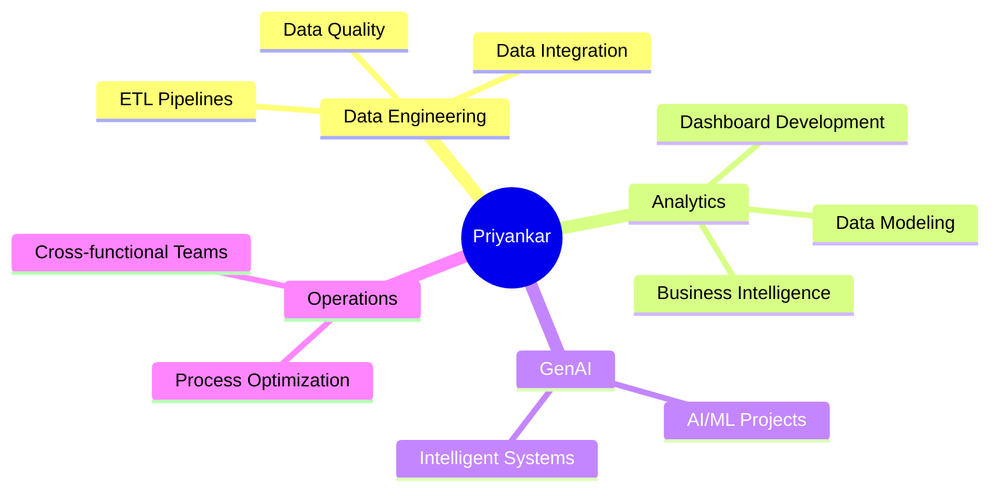

# Hi there, I'm Priyankar Patnaik 👋

## 🚀 About Me

I'm an **Operations & Analytics Professional** specializing in **GenAI projects**, data engineering, and business intelligence. Currently working at **Trellance**, previously contributed to **Razorpay** and **Signzy**.

> 💡 Passionate about transforming data into actionable insights and building intelligent systems that drive business value.

---

## 🎯 Core Competencies

### Technical Skills

---

## 💼 Featured Projects

### 🏦 Financial Analytics & BI Solutions

<table>
<tr>
<td width="50%">

#### 📊 Dashboard Glossary System
**Enterprise-wide data dictionary and metadata management**

- Built comprehensive glossary systems for Executive Financial Summary, Executive Summary, and Digital Banking dashboards
- Automated metadata documentation across DEV, QA, and UAT environments
- Created unified data definitions for cross-functional teams
- Improved data governance and self-service analytics

**Tech Stack:** SQL, Data Modeling, BI Tools, Azure DevOps

**Impact:** Enhanced data literacy and reduced reporting discrepancies across the organization

</td>
<td width="50%">

#### 🔄 Merchant Data Integration Platform
**Multi-core banking system integration and data cleansing**

- Integrated merchant data from 3 core banking systems (Episys, DNA, Keystone)
- Developed automated data cleansing workflows using pattern recognition
- Built STT (Standard Transaction Type) mapping system
- Implemented quality checks and validation framework

**Tech Stack:** Python, SQL, ETL, Data Quality Tools

**Impact:** Standardized merchant data across platforms, enabling accurate transaction analytics

</td>
</tr>
</table>

---

### 📈 Advanced Analytics & Data Science

<table>
<tr>
<td width="50%">

#### 💳 Transaction Classification Engine
**Intelligent transaction categorization system**

- Developed payroll indicator identification algorithm
- Built credit/debit bifurcation logic for transaction routing
- Analyzed ACH transaction types across multiple credit unions
- Created false positive/negative analysis framework

**Tech Stack:** Python, Machine Learning, SQL, Statistical Analysis

**Key Features:**
- ✅ Automated transaction type detection
- ✅ Pattern-based classification
- ✅ Multi-client validation framework
- ✅ Real-time data quality monitoring

</td>
<td width="50%">

#### 🔍 PSCU Deposit Transactions Analysis
**Deep-dive investigation and data pipeline optimization**

- Conducted SPIKE investigation on deposit transaction anomalies
- Analyzed transaction patterns across multiple clients
- Identified root causes of data inconsistencies
- Implemented corrective measures and validation checks

**Tech Stack:** SQL, Python, Data Analysis, Azure DevOps

**Deliverables:**
- 📋 Comprehensive analysis reports
- 🔧 Data pipeline improvements
- ✅ Multi-client validation protocols

</td>
</tr>
</table>

---

### 🛠️ Data Quality & Engineering

<table>
<tr>
<td width="50%">

#### ✅ Data Quality Assurance Framework
**End-to-end data validation and QA automation**

- Resolved 10+ critical QA defects in production systems
- Built automated sanity check frameworks
- Developed data reconciliation processes
- Created comprehensive testing and validation reports

**Highlights:**
- 🔍 Missing LOAN_ACCOUNT_IDs investigation
- 🎯 Merchant info validation across systems
- 📐 Net interest margin calculation fixes
- 🔄 Cross-system data consistency checks

</td>
<td width="50%">

#### 🏗️ Multi-Environment Deployment Pipeline
**Streamlined deployment across DEV, QA, and UAT**

- Automated deployment processes across environments
- Maintained data consistency through staging cycles
- Implemented rollback and recovery procedures
- Created environment-specific configuration management

**Tech Stack:** Azure DevOps, CI/CD, Infrastructure as Code

**Achievements:**
- ⚡ Reduced deployment time by 60%
- 🎯 Zero-downtime deployments
- 📊 Improved environment parity

</td>
</tr>
</table>

---

## 📊 Project Statistics

| Category | Projects Completed | Impact |
|----------|-------------------|--------|
| 📊 Dashboard & BI | 5+ | Enhanced data literacy org-wide |
| 🔄 Data Integration | 3+ | Unified multi-system data |
| 💳 Transaction Analytics | 4+ | Improved transaction accuracy |
| ✅ Data Quality | 10+ | Resolved critical production issues |
| 🚀 Deployments | 15+ | Seamless multi-env releases |

---

## 🎓 Domain Expertise

<b>Financial Services & Banking</b>

 

- Core Banking Systems (Episys, DNA, Keystone)
- Transaction Processing & Classification
- Deposit & Loan Analytics
- Merchant Data Management
- Financial Reporting & Compliance

<b>Data Engineering & Analytics</b>

 

- ETL/ELT Pipeline Development
- Data Warehousing & Modeling
- Business Intelligence & Visualization
- Data Quality & Governance
- Metadata Management

<b>GenAI & Advanced Analytics</b>

 

- AI/ML Model Integration
- Pattern Recognition & Classification
- Predictive Analytics
- Intelligent Automation
- Natural Language Processing

---

## 📫 Let's Connect

I'm always interested in collaborating on:
- 🤖 GenAI and AI/ML projects
- 📊 Data engineering and analytics initiatives
- 💼 Financial services technology
- 🔧 Open-source contributions

**Reach out:**
- 💌 Email: [patnaikfarm@gmail.com](mailto:patnaikfarm@gmail.com)
- 💼 LinkedIn: [Priyankar Patnaik](https://www.linkedin.com/in/priyankarpatnaik/)
- 🐱 GitHub: [@patnaikfarm](https://github.com/patnaikfarm)

---

### 🌟 "Turning data into insights, one project at a time" 🌟

