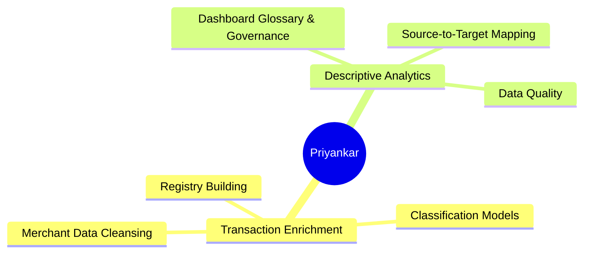

# Hi there, I'm Priyankar Patnaik 👋

## 🚀 About Me

I'm an **Operations & Analytics Professional** specializing in **GenAI projects**, data engineering, and business intelligence. Currently working at **Trellance**, previously contributed to **Razorpay** and **Signzy**.

> 💡 Passionate about transforming data into actionable insights and building intelligent systems that drive business value.

---

## 🎯 Core Competencies

```mermaid
%%{init: {'theme':'default', 'themeVariables': { 'primaryColor':'#E3F2FD','primaryTextColor':'#000','primaryBorderColor':'#1976D2','lineColor':'#1976D2','secondaryColor':'#FFF3E0','tertiaryColor':'#F3E5F5'}}}%%
mindmap
  root((Priyankar))
    Transaction Enrichment
      Merchant Data Cleansing
      Classification Models
      Registry Building
    Descriptive Analytics
      Dashboard Glossary & Governance
      Source-to-Target Mapping
      Data Quality
```

### Technical Skills

---

## 💼 Featured Work

All of the work below was scoped, tracked, and delivered as Product Backlog Items and tasks on **Azure DevOps Agile boards**, across two ongoing workstreams in a credit-union financial analytics platform.

### 🔄 Transaction Enrichment

<table>
<tr>
<td width="50%">

#### 🏪 Merchant Data Integration & Cleansing
**Multi-core banking system data normalization**

- Integrated and cleansed merchant data across 3 core banking platforms (Episys, DNA, Keystone) plus PSCU processor feeds
- Built regex-based pattern recognition to normalize raw merchant name strings
- Investigated and resolved cross-client deposit-transaction data anomalies
- Validated cleansing logic across multiple client datasets before production rollout

**Tech Stack:** Python, SQL, Regex, Data Quality Tools

</td>
<td width="50%">

#### 💳 Transaction Classification & Enrichment Models
**Intelligent transaction categorization system**

- Built a multi-class transaction classification model for automated categorization
- Developed payroll indicator identification and credit/debit bifurcation logic
- Built spending-channel classification (e.g. in-store, online, ATM, P2P) rule sets
- Created false-positive/false-negative analysis framework to tune model accuracy

**Tech Stack:** Python, Machine Learning, SQL, Statistical Analysis

</td>
</tr>
<tr>
<td width="50%">

#### 📇 Merchant & Provider Registries
**Reference data for enrichment pipelines**

- Built a Buy-Now-Pay-Later (BNPL) provider registry with merchant-mapping rules
- Built a subscription-service registry and merchant-mapping rule set
- Maintained and validated registries as new providers/merchants emerged

**Tech Stack:** SQL, Python, Azure DevOps

</td>
<td width="50%">

#### 🛡️ Financial Wellness Signals
**Responsible-lending & member-risk indicators**

- Contributed to detection logic for member reliance on high-cost short-term credit products
- Built scoring metrics and member-flagging logic for downstream risk/wellness reporting
- Supported cross-system data exploration to identify usable transaction signals

**Tech Stack:** SQL, Python, Data Analysis

</td>
</tr>
</table>

---

### 📊 Descriptive Analytics

<table>
<tr>
<td width="50%">

#### 📖 Dashboard Glossary & Metadata Governance
**Enterprise-wide data dictionary for BI dashboards**

- Built and maintained a glossary/data-dictionary system spanning loan, deposit, GL, and account-level dashboards (executive summary, digital banking, credit card, loan portfolio, and more)
- Automated metadata documentation and kept it in sync across dev, QA, and UAT environments
- Created unified, client-agnostic data definitions for cross-functional consumption

**Tech Stack:** SQL, Data Modeling, BI Tools, Azure DevOps

</td>
<td width="50%">

#### 🔗 Source-to-Target Mapping Maintenance
**Core-system field mapping for reporting accuracy**

- Updated and validated source-to-target field mappings for core loan attributes (e.g. interest rate, credit limit) across DNA and other core platforms
- Resolved data-quality defects including deduplication logic and missing/mismatched identifiers
- Evaluated new data sources (e.g. loan origination system fields) via research spikes before onboarding

**Tech Stack:** SQL, Python, Data Quality Tools

</td>
</tr>
</table>

---

### 🏗️ Delivery & Quality Practices

<table>
<tr>
<td width="50%">

#### ✅ Data Quality Assurance
**End-to-end validation and QA automation**

- Resolved production QA defects across transaction and reporting pipelines
- Built automated data-sanity-check frameworks (missing, null, and garbage value detection)
- Ran cross-system consistency checks and reconciliation reports

</td>
<td width="50%">

#### 🚀 Multi-Environment Release Management
**Consistent delivery across dev, QA, and UAT**

- Coordinated glossary/mapping/model releases across dev, QA, and UAT environments
- Maintained environment parity and reduced release-related discrepancies
- Iterated through Agile sprints on Azure DevOps boards

</td>
</tr>
</table>

---

## 📊 Project Statistics

| Category | Focus Area | Impact |
|----------|-----------|--------|
| 🔄 Transaction Enrichment | Merchant cleansing, classification models, registries | Standardized transaction data across core platforms |
| 📊 Descriptive Analytics | Dashboard glossary, source-to-target mapping | Improved data governance and reporting accuracy |
| ✅ Data Quality | Defect resolution, sanity checks | Resolved critical production data issues |
| 🚀 Deployments | Multi-environment releases | Seamless dev → QA → UAT delivery |

---

## 🎓 Domain Expertise

<b>Financial Services & Banking</b>

 

- Core Banking Systems (Episys, DNA, Keystone, PSCU)
- Transaction Processing, Enrichment & Classification
- Deposit & Loan Analytics
- Merchant Data Management
- Financial Reporting & Compliance

<b>Data Engineering & Analytics</b>

 

- ETL/ELT Pipeline Development
- Data Warehousing & Modeling
- Business Intelligence & Visualization
- Data Quality & Governance
- Metadata Management

<b>GenAI & Advanced Analytics</b>

 

- AI/ML Model Integration
- Pattern Recognition & Classification
- Predictive Analytics
- Intelligent Automation
- Natural Language Processing

---

## 📫 Let's Connect

I'm always interested in collaborating on:
- 🤖 GenAI and AI/ML projects
- 📊 Data engineering and analytics initiatives
- 💼 Financial services technology
- 🔧 Open-source contributions

**Reach out:**
- 💌 Email: [patnaikfarm@gmail.com](mailto:patnaikfarm@gmail.com)
- 💼 LinkedIn: [Priyankar Patnaik](https://www.linkedin.com/in/priyankarpatnaik/)
- 🐱 GitHub: [@patnaikfarm](https://github.com/patnaikfarm)

---

### 🌟 "Turning data into insights, one project at a time" 🌟

